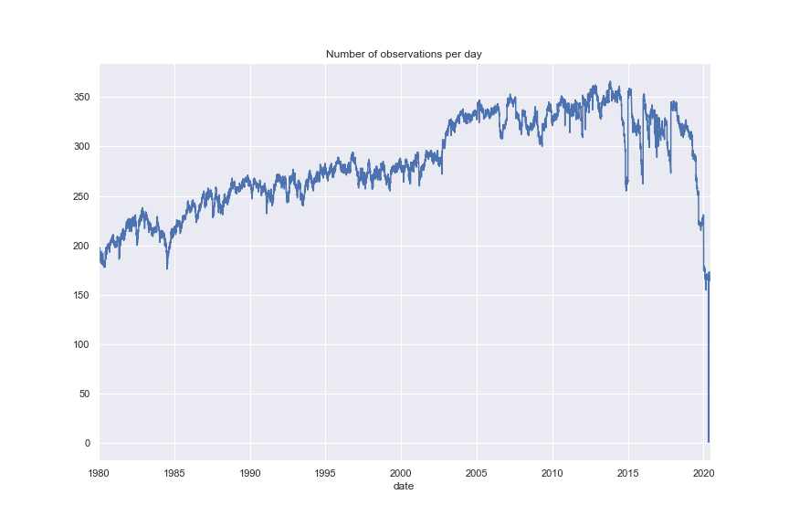
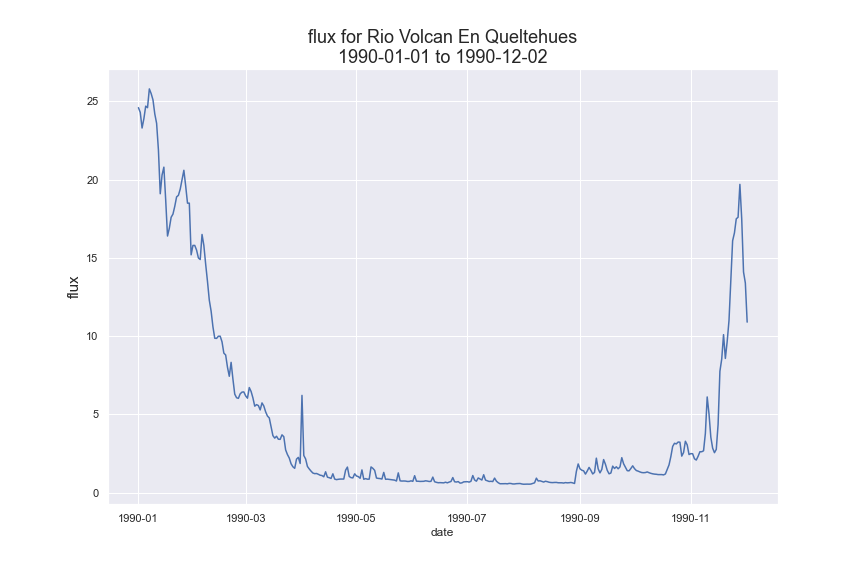

# Watershed Challenge
Trying to predict flux 

## Summary

This repository main goal is to answer questions regarding climate changes. We will try to predict extreme watershed events in Chile. We will follow questions and instructions provided by the [watershed challenge](https://github.com/SpikeLab-CL/challenge_watershed#important-points-to-take-into-account).

## Dataset

The database contains the following variables between others:

 - date: date of measurement
 - basin_id: station code
 - gauge_name: name of the watershed
 - flux: water flux for that day
 - aprecip: average precipitation for that day in that watershed
 - temp_max: maximum average temperature for that day in that watershed
 - lat: Latitude
 - lon: Longitude
 - mean_elev: average elevation from sea level
 - area_km2: watershed's area


The file flux.csv contains all the data used for this challenge. This database was produced by Bain and synthesizes flux, temperature and precipitation data.

Note about the database: the stations which measure flux and the stations that measure temperature and precipitation are not located at the same place. For building this database, they took the watershed's upstream polygon and find the temperature and precipitation stations inside this polygon, and they calculated the average over that variables. In this way, every flux measure will be accompanied of a unique temperature and precipitation measure.

## Challenge

1.Download the file flux.csv from github (compressed as flux.csv.zip).

2. Perform an EDA over flux.csv file.

Most of the EDA can be found on the [notebook](watershed_challenge.ipynb)

One side note is that the there is a huge drop on the number of observation by the end of 2020. I don't know exactly the cause, but I did not use the whole year for the last part of the assigment (modeling).



3. Plot flux, temperature and precipitations:
    a) Write a function that plot a time series of a specific variable (flux, temp, precip) from a station. 
    ```python
    def plot_one_timeserie(cod_station, variable, min_date, max_date):
    sns.set(rc={'figure.figsize':(12,8)})
    
    df = data[(data["gauge_name"] == cod_station)
             &(data['date'] >= min_date)
             &(data['date'] <= max_date)].copy()

    ax = sns.lineplot(x = 'date',
                      y = variable,
                      data = df)
    title = variable + " for " + cod_station + "\n" + min_date + " to "  + max_date
    plt.ylabel(variable ,size = 15)
    plt.title(title, size = 18)
    plt.show()
    return ax
    
    ```
    
  
  
  b) Now write a function that plots the 3 variables at the same time. As the variables are in different scales, you can normalize before plotting them.
  ```python
  def plot_three_timeseries(cod_station, min_date, max_date):
    # Set Figure size    
    sns.set(rc={'figure.figsize':(12,8)})
    df = data[(data["gauge_name"] == cod_station)
             &(data['date'] >= min_date)
             &(data['date'] <= max_date)].copy()
    
    # Function used to normalize data
    def normalize(x):
        return ((x - x.mean())/x.std())
    
    # Normalize each variable
    df = df.assign(temp_max_norm = normalize(df['temp_max']),
                   flux_norm = normalize(df['flux']),
                   precip_norm = normalize(df['precip']))
    
    # Plot temp_max normalized
    ax = sns.lineplot(x = 'date',
                      y = 'temp_max_norm',
                      data = df,
                      label = 'temp_max_norm')
    # Plot flux normalized
    bx = sns.lineplot(x = 'date',
                      y = 'flux_norm',
                      data = df,
                      label = 'flux_norm')
    
    # Plot precip normalized
    cx = sns.lineplot(x = 'date',
                      y = 'precip_norm',
                      data = df,
                      label = 'precip_norm') 
    
    # Plot aesthetics
    title = "Normalized Variables "+ cod_station + "\n" + min_date + " to "  + max_date
    plt.ylabel("")
    plt.title(title, size = 18)
    plt.show()
    return ax    
  ```
  
4. Create three variables called:

 - flux_extreme
 - temp_extreme
 - precip_extreme
This variables should take the value of 1 when that variable in a specific day was extreme. Being extreme could be considered as being greater than expected. For example, a flux can be considered as extreme (value 1) when is over the 95 percentile of the flux distribution for that specific season, and takes the value 0 otherwise. Taking into account the seasonality of that variables is very important, because  could be considered as extreme in wintertime, but it’d be a normal temperature for summertime.


First I created my seasons using meteorological seasons. Most of our study here is about climate behavior, using astronomical seasons is not logical.

```python
seasons = [1, 1, 2, 2, 2, 3, 3, 3, 4, 4, 4, 1]
month_to_season = dict(zip(range(1,13), seasons))
data['season'] = data.date.dt.month.map(month_to_season)
```

The I created a function and applied it to the 3 different variables:
 ```python
 def extreme(df, variable):
    # Get 95th quantile for each watershed station/season
    df_quantile = df.groupby(["season", "basin_id"]).quantile([0.95]).reset_index()
    df_quantile = df_quantile[["season", "basin_id", variable]].rename(columns = {variable: variable + "_95"})

    # Join with original dataset
    df = pd.merge(df, df_quantile, 
                on = ["season", "basin_id"])
    
    # Compare variable to 95th percentile
    df[variable + '_extreme'] = (df[variable] >  df[variable + "_95"])*1
    df = df.drop(columns = [variable + "_95", ])
    return df
 ```


Do you consider this a good way of capturing extreme events? Or you would have used a different method? Which one?
  
That is a reasonable way to capture extreme events. We can use standard deviations distance as well (if the data distribution is normal). There is just one small concern regarding extreme temperatues. Using the 95th percentile, we are discarding *extreme low events*. We might as well use 95th *and* 5th percentile for temperature instead.

