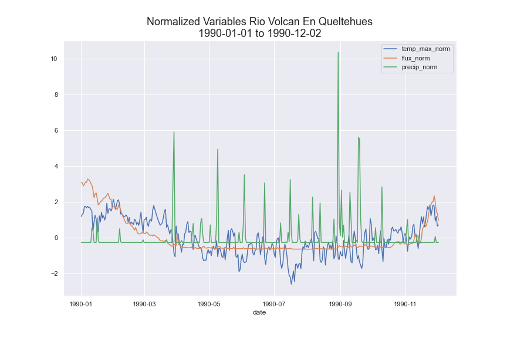
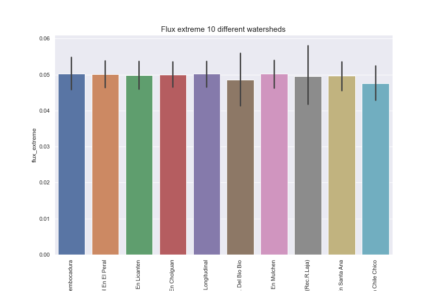
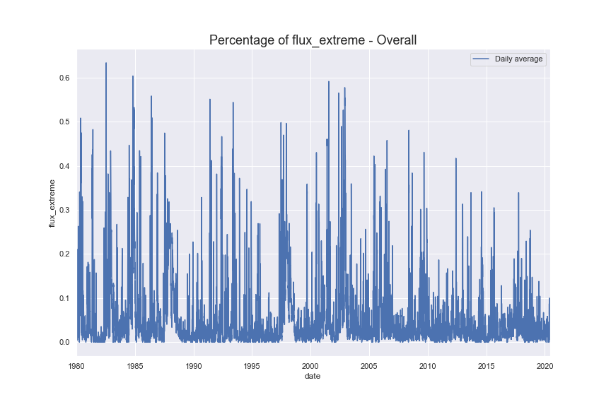
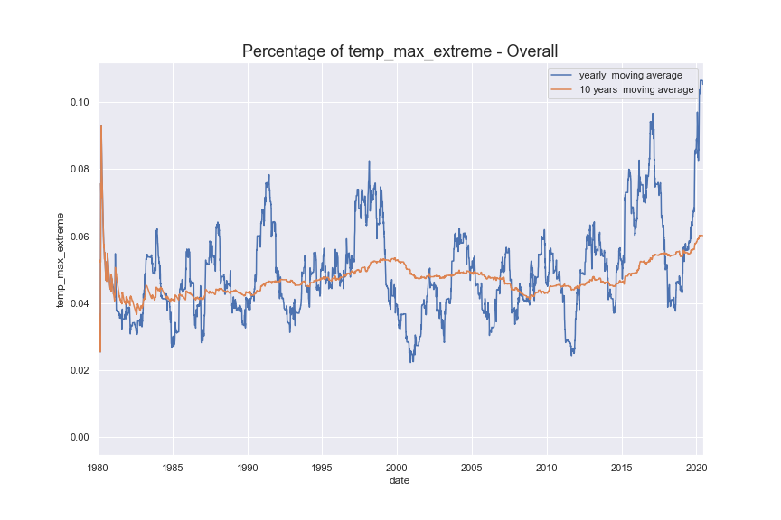
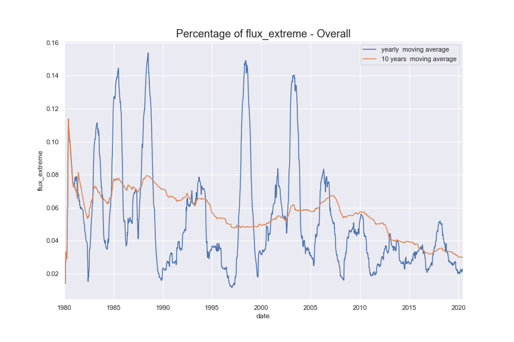
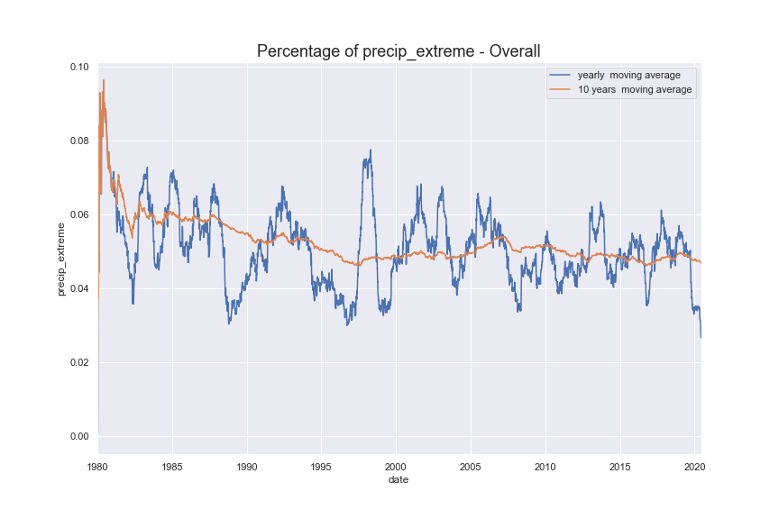
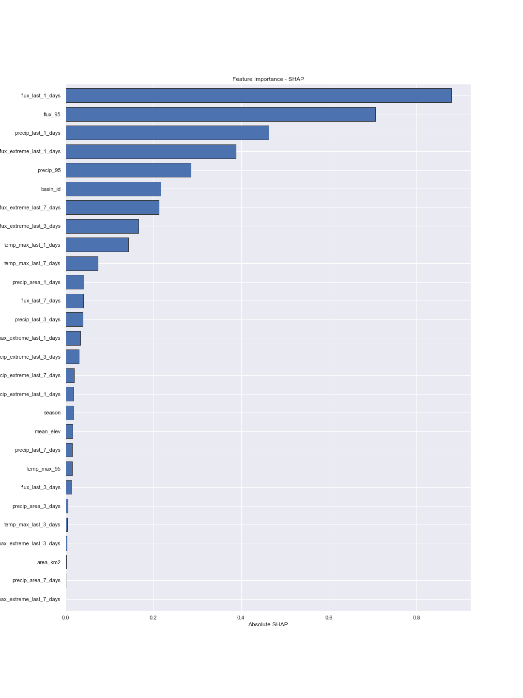
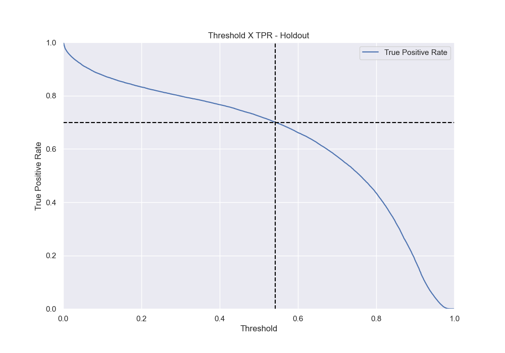

# Watershed Challenge


This repository main goal is to answer questions regarding climate changes. We will try to predict extreme watershed events in Chile. We will follow questions and instructions provided by the [watershed challenge](https://github.com/SpikeLab-CL/challenge_watershed#important-points-to-take-into-account).

## Dataset

The database contains the following variables between others:

 - date: date of measurement
 - basin_id: station code
 - gauge_name: name of the watershed
 - flux: water flux for that day
 - aprecip: average precipitation for that day in that watershed
 - temp_max: maximum average temperature for that day in that watershed
 - lat: Latitude
 - lon: Longitude
 - mean_elev: average elevation from sea level
 - area_km2: watershed's area


The file flux.csv contains all the data used for this challenge. This database was produced by Bain and synthesizes flux, temperature and precipitation data.

Note about the database: the stations which measure flux and the stations that measure temperature and precipitation are not located at the same place. For building this database, they took the watershed's upstream polygon and find the temperature and precipitation stations inside this polygon, and they calculated the average over that variables. In this way, every flux measure will be accompanied of a unique temperature and precipitation measure.

## Challenge

1.Download the file flux.csv from github (compressed as flux.csv.zip).

2. Perform an EDA over flux.csv file.

Most of the EDA can be found on the [notebook](watershed_challenge.ipynb)

One side note is that the there is a huge drop on the number of observation by the end of 2020. I don't know exactly the cause, but I did not use the whole year for the last part of the assigment (modeling).


3. Plot flux, temperature and precipitations:
    a) Write a function that plot a time series of a specific variable (flux, temp, precip) from a station. 
    ```python
    def plot_one_timeserie(cod_station, variable, min_date, max_date):
    sns.set(rc={'figure.figsize':(12,8)})
    
    df = data[(data["gauge_name"] == cod_station)
             &(data['date'] >= min_date)
             &(data['date'] <= max_date)].copy()

    ax = sns.lineplot(x = 'date',
                      y = variable,
                      data = df)
    title = variable + " for " + cod_station + "\n" + min_date + " to "  + max_date
    plt.ylabel(variable ,size = 15)
    plt.title(title, size = 18)
    plt.show()
    return ax
    
    ```
    
  
  
  b) Now write a function that plots the 3 variables at the same time. As the variables are in different scales, you can normalize before plotting them.
  ```python
  def plot_three_timeseries(cod_station, min_date, max_date):
    # Set Figure size    
    sns.set(rc={'figure.figsize':(12,8)})
    
    # Query data from cod_station and time interval    
    df = data[(data["gauge_name"] == cod_station)
             &(data['date'] >= min_date)
             &(data['date'] <= max_date)].copy()
    
    # Function used to normalize data
    def normalize(x):
        return ((x - x.mean())/x.std())
    
    # Normalize each variable
    df = df.assign(temp_max_norm = normalize(df['temp_max']),
                   flux_norm = normalize(df['flux']),
                   precip_norm = normalize(df['precip']))
    
    # Plot temp_max normalized
    ax = sns.lineplot(x = 'date',
                      y = 'temp_max_norm',
                      data = df,
                      label = 'temp_max_norm')
    # Plot flux normalized
    bx = sns.lineplot(x = 'date',
                      y = 'flux_norm',
                      data = df,
                      label = 'flux_norm')
    
    # Plot precip normalized
    cx = sns.lineplot(x = 'date',
                      y = 'precip_norm',
                      data = df,
                      label = 'precip_norm') 
    
    # Plot aesthetics
    title = "Normalized Variables "+ cod_station + "\n" + min_date + " to "  + max_date
    plt.ylabel("")
    plt.title(title, size = 18)
    plt.show()
    return ax    
  ```

  
4. Create three variables called:

 - flux_extreme
 - temp_extreme
 - precip_extreme
 <br>
This variables should take the value of 1 when that variable in a specific day was extreme. Being extreme could be considered as being greater than expected. For example, a flux can be considered as extreme (value 1) when is over the 95 percentile of the flux distribution for that specific season, and takes the value 0 otherwise. Taking into account the seasonality of that variables is very important, because  could be considered as extreme in wintertime, but it’d be a normal temperature for summertime.


First I created my seasons using meteorological seasons. Most of our study here is about climate behavior, using astronomical seasons is not logical. Also, all the watershed are located in the south hemisphere, so they have the same seasons.

```python
seasons = [1, 1, 2, 2, 2, 3, 3, 3, 4, 4, 4, 1]
month_to_season = dict(zip(range(1,13), seasons))
data['season'] = data.date.dt.month.map(month_to_season)
```

Afterwards, I created a function and applied it to the 3 different variables:
 ```python
 def extreme(df, variable):
    # Get 95th quantile for each watershed station/season
    df_quantile = df.groupby(["season", "basin_id"]).quantile([0.95]).reset_index()
    df_quantile = df_quantile[["season", "basin_id", variable]].rename(columns = {variable: variable + "_95"})

    # Join with original dataset
    df = pd.merge(df, df_quantile, 
                on = ["season", "basin_id"])
    
    # Compare variable to 95th percentile
    df[variable + '_extreme'] = (df[variable] >  df[variable + "_95"])*1
    return df
 ```
 
I kept the columns `season` and `_95` because I will use them later on.


Do you consider this a good way of capturing extreme events? Or you would have used a different method? Which one?
  
That is a reasonable way to capture extreme events. We can use standard deviations distance as well (if the data distribution is normal). There is just one small concern regarding extreme temperatues. Using the 95th percentile, we are discarding **extreme low events**. We might as well use 95th **and 5th percentile** for temperature instead.


5. Plot the variable flux_extreme. Are there any different behaviours among different watersheds?

For this part, I did not plot all the watersheds because there were over 500 different watersheds. Instead I randomly picked 10 different watersheds and analyzed their differences instead.

If you plot the average `flux_extreme` for the watershed, they are all arround 5% (as expected of the 95th percentile).



However, if you take a closer look at the time series for flux and 95th percentile, you can see that there are some differences.


You can see that for Estero, there are some really extreme flux events that are 6 to 7 bigger than the 95th percentile. On the other hand, we have Rio Buero, if rare events that are only 2 to 3 time bigger than the 95th percentile.

6. Plot the percentage of extreme events during time. Have they become more frequent?

If you just plot daily extreme events, the data is very noisy and we can't see any clear patterns.



However if we take the yearly moving average value and 10 years moving average value, we can see some trends happening. Looks like the overall:

 - **max temperature extreme is increasing**


 - **flux extreme is decreasing**


 - **precipitation extreme is decreasing**



7. Extreme flux prediction. Train one or many models (using your preferred algorithms) for estimating the probability of having an extreme flux. Feel free to create new features or use external variables. Some of the discussion we would like to see: Which data can be used and which cannot? Of course, we cannot use future data, but what about data from the same day? Or from the previous day?
<br>
Everything depends on how you propose the model use. Make a proposal on how you would use the model in practice (for example, once trained, the model will predict next day probability). Depending on your proposal, set constraints about which variables you can or cannot use.

#### Modeling

##### Data Splitting

I divided my dataset in 3:
 - Training Set - 80% of my data from 1980-01-01 to 2010-01-01
 - Test Set - 20% of my data from 1980-01-01 to 2010-01-01
 - Holdout Set - 100% of my data from 2010-01-01 to 2020-01-01
 
I discarded any data from 2020 onwards because the the number of observations changed drastically in this time period.

##### Features

From my point of view, it would be really hard to use real time data of precipitation and temperature, but we can still use data from the previous day to predict next day probability. Therefore, I created several new features:

 - Features of cumulative precipitation, temp_max and flux for last 1, 3 and 7 days
 - Features of precipitation over area for last 1, 3 and 7 days
 
I also needed to recalculate the 95th percentile for each variable in the **training set only**.

##### Training

I used LightGBM algorithim framework with default parameters. I did not perform any kind of hyperparemeter tuning because I felt that unecessary.

8. Analyze the model results.

a) What is the performance of the model? Which metrics you consider are the best suited for this problem? What are the most important variables? What do you think about the results?

The performance of the model is really optimistic:

| Split | AUC | LogLoss|
|-------|:---:|:-------|
| Train| 0.982|0.0590|
| Test| 0.981| 0.062|
| Holdout|0.978 |0.047|

I think the most important metric would be ROC-AUC, because we want to maximize the True Positive Rate and minimize False Positive Rate. 

We can see feature importance using SHAP:



The 5 most important features are:

 - flux_last_1_days - flux of the last day
 - flux_95 - 95th percentile flux for this watershed/season
 - precip_last_1_days - precipitation of the last day
 - flux_extreme_last_1_days - if the last day was a flux extreme event or not
 - precip_95 - 95th percentile precipitation for this watershed/season
 
All last 1 days variables are really important, temperature max doesn't seem to mather to the model. I do think the results are unreal. It might be harder to predict if we don't have the last day data or to forecast more than the next day. I wonder how well this model would perform if we want to predict the next 5 days instead.

b) If we wanted to identify at least 70% of the extreme flux events, which are the metrics of your model for that threshold? It is a useful model?

We need to have 70% of True Positive Rate(known as recall or sensitivity). If we plot the Threshold x True Positive Rate, we can see that the we need to choose threshold of 0.542. If we pick any number below our current threshold, we will get more positive cases (so we can identify over 70%) but we will also have a higher chance of having false positives. 




It is a useful model to predict next day flux_extreme events for sure!

